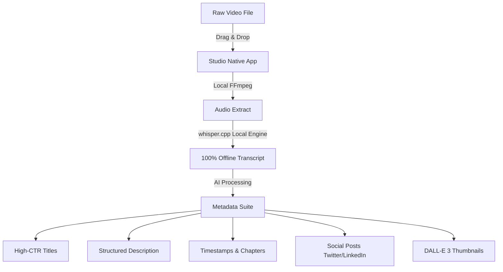

# 🎬 Studio — AI-Powered Video-to-Content for macOS

**Studio** is a native macOS application designed specifically for YouTubers, video editors, and content creators. It automates your post-production metadata generation by combining blazing-fast **on-device AI models** with optional cloud API integrations.

Get high-CTR titles, structured descriptions, accurate timestamps/chapters, tags, Twitter (X) threads, LinkedIn posts, and DALL-E 3 thumbnail concepts — all from a single video drop.

---

## 🚀 Key Features

1. **Local Audio Extraction & Transcription**
   - Drag and drop any video file (`.mp4`, `.mov`, `.mkv`, etc.).
   - Instant audio extraction using bundled **FFmpeg**.
   - Offline, private, on-device transcription running **Whisper AI (`whisper.cpp`)** optimized for Apple Silicon (CoreML). No heavy video uploads to the cloud.

2. **SEO-Optimized YouTube Metadata**
   - **Titles:** Generate high-CTR, curiosity-driven titles (kept under 70 characters).
   - **Descriptions:** Auto-structured descriptions with compelling hooks, summaries, and social CTAs.
   - **Chapters:** Automatic detection of video sections formatted cleanly (e.g., `00:00 - Intro`).
   - **Tags & Keywords:** Curated list of high-volume, long-tail, and trending tags.

3. **Social Media Virality Engine**
   - Automatically drafts engaging, scroll-stopping Twitter (X) threads based on your transcript.
   - Drafts professional B2B LinkedIn posts highlighting the key takeaways.

4. **AI Thumbnail Studio**
   - Generates visual thumbnail concepts and psychological hooks.
   - Built-in integration with **OpenAI DALL-E 3** to generate actual thumbnail images directly in the app using subject references.

5. **Polished Native macOS Experience**
   - Fully native SwiftUI app with SwiftData persistence.
   - Sleek glassmorphic UI, live processing progress overlays, and workspace organization.

---

## 📊 How It Works (Architecture)

---

## 💻 System Requirements

- **Operating System:** macOS 13.0 (Ventura) or newer.
- **Hardware:** Optimized for **Apple Silicon (M1, M2, M3, M4)**. Intel Macs are supported but on-device transcription will run slower.
- **Disk Space:** ~150MB for the application. Additional disk space is recommended for local Whisper models.
- **API Keys (Optional):** An OpenAI API Key is required for cloud-based functions (Metadata Generation and DALL-E 3 Thumbnail Generation).

---

## 📦 Installation

1. Go to the [Releases](https://github.com/Yuvadi29/studio-releases/releases) page.
2. Download the latest `Studio.dmg`.
3. Open the `Studio.dmg` file.
4. Drag **Studio** to your **Applications** folder.
5. Launch the app and streamline your workflow!

---

## 🔒 Privacy First

Studio was built with privacy as a core tenet. Your raw video files and audio extractions never leave your computer. Transcription is performed 100% locally on-device. Cloud APIs are strictly optional and only utilized when generating text outputs or thumbnails via your own OpenAI API keys.
